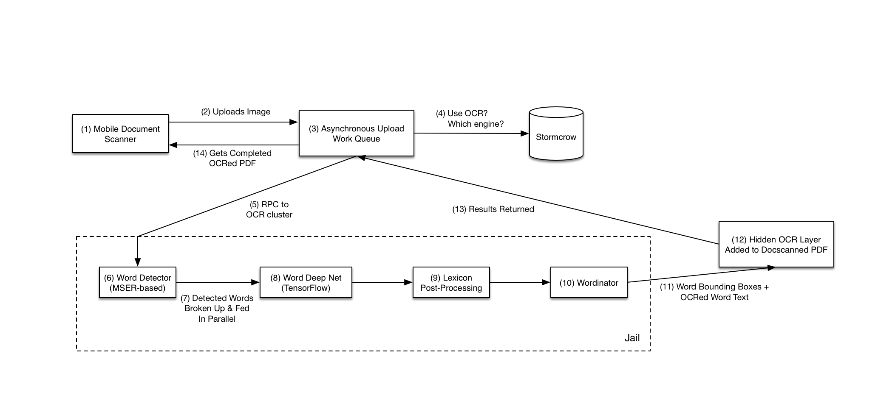
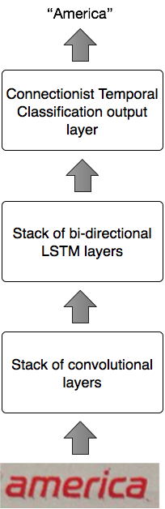

---
# Technical Walkthrough of the OCR Pipeline

---
## Goal
To have an end-to-end system that can find and extract from images.

---
## Pipeline Overview

---
## Pipeline Modules
---
### Word Deep Net  

---
- [ ] **Single Word Accuracy**
  - [x] Large dataset - 9M images Oxford MJSynth dataset
  - [x] Code to generate synthetic images
  - [ ] Experiments on the WDN (using Jupyter Notebooks)
    - [x] Regular architecture, based on the Keras example.
      - Trained on ~20% of the samples, performance plateaus at ~7% accuracy.

---

  - [x] Batch normalization added to above architecture.
    - Considerable performance improvement, accuracy ~35% by training after training on ~10% of the samples.
  - [ ] Dropout
  - [ ] Colour/B&W images
  - [ ] Trying various architectures for the CNN stack
    - [ ] ResNet
    - [ ] InceptionNet
    - [ ] Combinations and Ensembles

---

  - [ ] Variable sized images using Spatial Pyramid Pooling (SPP)
    - Dropbox had an issue with longer words as they had a constant size WDN.
  - [ ] Further train and test on synthetic images
    - [ ] Two word, three word
    - Suggestions?  

---
### Word Detector  

- [ ] **Word Detector**
  - [ ] Maximally Stable Extermal Regions (MSER)
    - Implementation in opencv  

### Integration

- [ ] **Integration of WDN and Word Detector**
  - [ ] Training and testing on the whole system
  - Possible tweaks
    - A confidence measure

