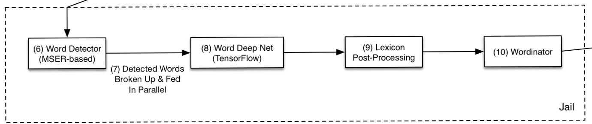

---
# Technical Walkthrough of the OCR Pipeline

---
## Goal
To build an end-to-end system that can find and extract text from images.

---
## Pipeline Overview

---
## Pipeline Modules
---
### Word Deep Net  

---
- [ ] **Single Word Accuracy**
  - [√] Large dataset - 9M images Oxford MJSynth dataset
  - [√] Code to generate synthetic images
  - [ ] Experiments on the WDN (using Jupyter Notebooks)
    - [√] Starting point, architecture based on a Keras example 
      - Trained on ~20% of the samples, performance plateaus at ~7% accuracy

---

  - [√] Batch normalization added to above architecture.
    - Considerable performance improvement, accuracy ~35% after training on ~10% of the samples
  - [ ] Dropout
  - [ ] Colour/B&W images
  - [ ] Trying various architectures for the CNN stack
    - [ ] ResNet
    - [ ] InceptionNet
    - [ ] Combinations and Ensembles

---

  - [ ] Variable sized images using Spatial Pyramid Pooling (SPP)
    - Dropbox had an issue with longer words as they had a constant size WDN
  - [ ] If needed, train and test on more synthetic images
  - [ ] And on Real data from the domain where this is going to be used
    - [ ] Two word, three word?
  - Suggestions?  

---
### Word Detector  

- [ ] **Word Detector**
  - [ ] Maximally Stable Extermal Regions (MSER)
    - Implementation in opencv
  - [ ] Detected regions split into single words

---

### Integration

- [ ] **Integration of WDN and Word Detector**
  - [ ] Training and testing on the whole system
  - Possible tweaks
    - A confidence measure of the final output
      - If high confidence, report result
      - If low confidence, ignore result
      - If medium confidence, consult lexicon on the most probable match

---
  
  
### Thank You

